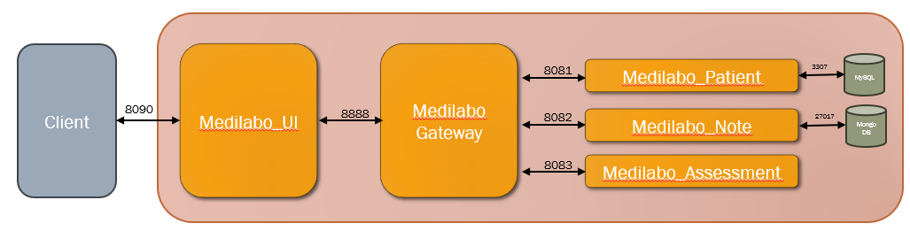

# Medilabo

Medilabo est une application à destination des médecins pour aider à détecter le diabète de type 2. 

L’application permet :
- d’enregistrer les données démographiques (nom, âge) des patients
- d’ajouter des notes de compte rendu de visite
- de classifier le risque qu’un patient développe un diabète en fonction des éléments précédemment saisis.

## Infos
- Java version 17
- Spring Boot 3.0.4
- Spring Cloud 4.0.1
- Mysql 8.0.32 
- MongoDB 7.0.5
- Docker Engine 26.0.0

## Microservices
Application en microservices dockérisés comprenant un service Interface Utilisateur (UI), une Gateway (Spring Cloud Gateway), 3 microservices métiers.
Le microservice Medilabo_Patient communique avec le SGBDR MySQL, MongoDB est utilisé pour les données NoSQL exploitées par le microservice Medilabo_Note

- Lien Medilabo_Patient : addMedilabo_Patient
- Lien Medilabo_Note : addMedilabo_Note
- Lien Medilabo_Assessment : addMedilabo_Assessment
- Lien Medilabo_UI : addMedilabo_UI

## Execution
- Après lancement de docker la construction et le démarrage du conteneur s'effectue via la commande `docker-compose up --build`

- Le site est accessible a l'adresse : [http://localhost:8090/login](http://localhost:8090/login)

- La connexion disponible par défaut est :
  - username : user
  - password : medilabo

   L'ajout d'habilitation à d'autres utilisateurs peut s'effectuer via Postman avec le end point [POST] http://localhost:8888/api/auth/signin avec en Body :
   {
   "username": "nom_utilisateur",
   "password": "mot_de_passe_utilisateur"
   }

  

 
